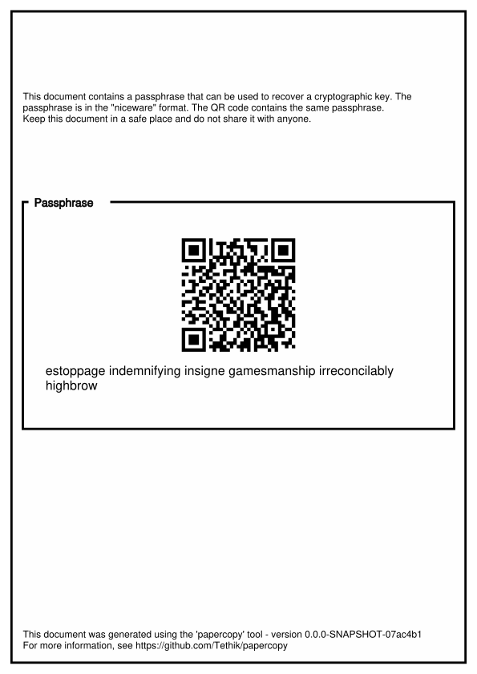

# Papercopy

Tool to generate a papercopy of cryptographic keys in a PDF format.

**☢️⚠️ Currently being prototyped. Not production ready. You've been warned.**

## Usage 🧑‍💻

The repo comes with two binaries. Download from github release page or build it yourself via `make`.

* `niceware` to encode bytes to a niceware string. `niceware -d` to decode a niceware string. 
* `papercopy` to encode and create a (soon to be) neat PDF to which will keep your key.

